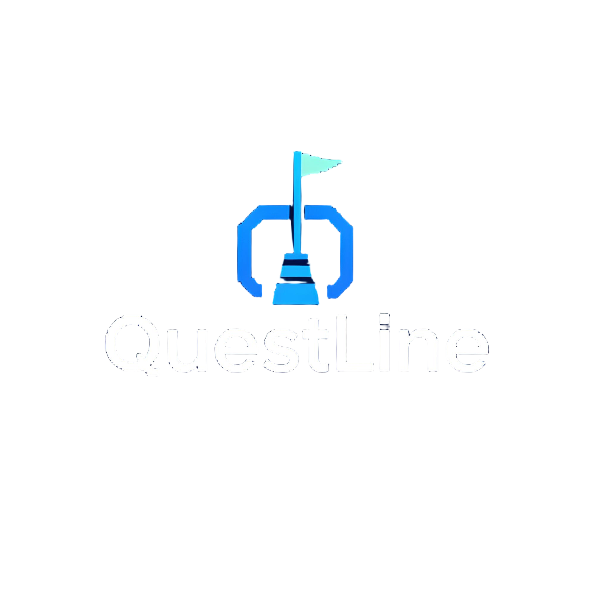

<p align="center">
  
</p>

## Overview
Questline is a web-based project management platform designed for game development. It centralizes documentation, task assignment, and timelines to enhance team collaboration and productivity.

**This Repository currently holds the development of the project. This is NOT a finished project!!**

## Key Features
- **User & Team Management**: Secure registration, team roles, and permissions.
- **Task Management**: Create, assign, and track tasks with deadlines.
- **Documentation**: Centralized document storage with version control.
- **Timelines**: Visualize project schedules with organized task duedates
- **Real-Time Collaboration**: Instant updates and comments on tasks.

## Screenshots
<p align="center">
  
  
  
  
</p>

## Installation
### Requirements:
- Node.js
- Git
### Steps to Run Locally:
1. Clone the Repository
```
git clone https://github.com/traemorton/QuestLine.git
```
2. Open in IDE
3. Install Dependencies
```
npm install
```
3. MongoDB setup
- [Windows Setup Guide](https://www.mongodb.com/docs/manual/tutorial/install-mongodb-on-windows/)
- [MacOS Setup Guide](https://www.mongodb.com/docs/manual/tutorial/install-mongodb-on-os-x/)
4. Start the Application
```
npm run devStart
```
5. Open the app in browser
```
http://localhost:3000
```
